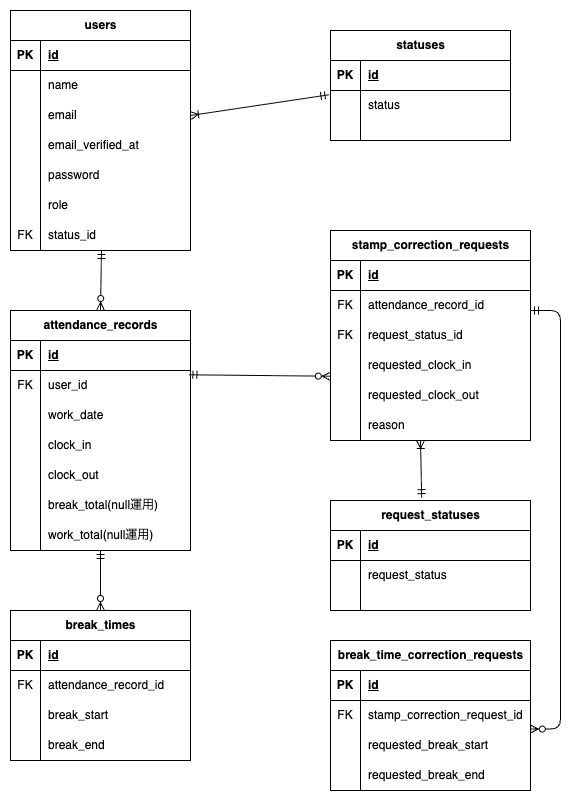

# 勤怠管理アプリ

## 概要
一般ユーザーと管理者向けの勤怠管理アプリです。
ユーザーは出勤・休憩・退勤の打刻、勤怠一覧確認、勤怠修正申請を行うことができます。
管理者は全ユーザーの勤怠管理、修正申請の承認、CSV出力を行うことができます。
メール認証機能を導入し、認証済みユーザーのみ勤怠機能を利用可能です。

---

## 作成背景
勤怠管理業務を想定し、
* 認証
* 勤怠登録
* 勤怠集計
* 修正申請
* 承認フロー
を含む業務アプリケーションとして開発しました。

---

## 主な機能一覧

### 一般ユーザー
* 会員登録
* ログイン
* メール認証
* 出勤
* 休憩開始
* 休憩終了
* 退勤
* 勤怠一覧表示
* 勤怠詳細表示
* 勤怠修正申請
* 修正申請一覧表示

### 管理者
* 管理者ログイン
* 全ユーザー勤怠一覧
* 勤怠詳細編集
* スタッフ一覧
* スタッフ別勤怠一覧
* 修正申請一覧
* 修正申請承認
* CSVダウンロード

---

## 使用技術

### バックエンド / フロントエンド
* PHP 8.2.11
* Laravel 8.83.8

### インフラ・データベース
* MySQL 8.0.26
* Nginx 1.21.1
* Docker (開発環境)
* phpMyAdmin (DB管理)

### テスト
* PHPUnit (Feature Test)

---

## 環境構築

1. リポジトリのクローン
Docker Desktopを起動した状態で、以下を実行します。
```bash
git clone git@github.com:mitoyuu/attendance.git
cd attendance
```
2. 初期セットアップ
```bash
make init
```
上記コマンドで以下の処理が自動実行されます。
* Dockerコンテナのビルド・起動
* Composerによるパッケージインストール
* .envファイルの作成 & アプリケーションキー生成
* アプリケーションキー生成
* マイグレーション & 初期シーディング実行

### 起動

```bash
make up
```

### 停止

```bash
make stop
```

### DB再構築（初期化＋シード）

```bash
make fresh
```
---

## メール認証
Mailtrapというツールを使用しています。<br>
以下のリンクから会員登録をしてください。　<br>
https://mailtrap.io/

メールボックスのIntegrationsから 「laravel 7.x and 8.x」を選択し、　<br>
Mailtrap発行値を.envへ設定<br>
MAIL_FROM_ADDRESSは任意のメールアドレスを入力してください。　

---

## テストアカウント
name: 一般ユーザ1
email: general1@gmail.com
password: password
-------------------------
name: 一般ユーザ2
email: general2@gmail.com
password: password
-------------------------
name: 管理者
email: admin@test.com
password: password
-------------------------

## PHPUnitを利用したテストに関して
以下のコマンド:
```
//テスト用データベースの作成
docker-compose exec mysql bash
mysql -u root -p
//パスワードはrootと入力
create database test_database;

docker-compose exec php bash
php artisan migrate:fresh --env=testing
./vendor/bin/phpunit
```
---
## ER図


---
## テーブル仕様

### usersテーブル
| カラム名              | 型            | primary key | unique key | not null | foreign key  |
| ----------------- | ------------ | ----------- | ---------- | -------- | ------------ |
| id                | bigint       | ◯           |            | ◯        |              |
| name              | varchar(255) |             |            | ◯        |              |
| email             | varchar(255) |             | ◯          | ◯        |              |
| email_verified_at | timestamp    |             |            |          |              |
| password          | varchar(255) |             |            | ◯        |              |
| role              | tinyInteger  |             |            | ◯        |              |
| status_id         | bigint       |             |            | ◯        | statuses(id) |
| remember_token    | varchar(100) |             |            |          |              |
| created_at        | timestamp    |             |            |          |              |
| updated_at        | timestamp    |             |            |          |              |

---
### statusesテーブル
| カラム名       | 型            | primary key | unique key | not null | foreign key |
| ---------- | ------------ | ----------- | ---------- | -------- | ----------- |
| id         | bigint       | ◯           |            | ◯        |             |
| status     | varchar(255) |             |            | ◯        |             |
| created_at | timestamp    |             |            |          |             |
| updated_at | timestamp    |             |            |          |             |

---
### attendance_recordsテーブル
| カラム名        | 型         | primary key | unique key | not null | foreign key |
| ----------- | --------- | ----------- | ---------- | -------- | ----------- |
| id          | bigint    | ◯           |            | ◯        |             |
| user_id     | bigint    |             |            | ◯        |users(id)    |
| work_date   | date      |             |            |          |             |
| clock_in    | datetime  |             |            |          |             |
| clock_out   | datetime  |             |            |          |             |
| break_total | integer   |             |            |          |             |
| work_total  | integer   |             |            |          |             |
| created_at  | timestamp |             |            |          |             |
| updated_at  | timestamp |             |            |          |             |

---
### break_timesテーブル
| カラム名                 | 型         | primary key | unique key | not null | foreign key            |
| -------------------- | --------- | ----------- | ---------- | -------- | ---------------------- |
| id                   | bigint    | ◯           |            | ◯        |                        |
| attendance_record_id | bigint    |             |            | ◯        | attendance_records(id) |
| break_start          | datetime  |             |            |          |                        |
| break_end            | datetime  |             |            |          |                        |
| created_at           | timestamp |             |            |          |                        |
| updated_at           | timestamp |             |            |          |                        |

---
### stamp_correction_requestsテーブル
| カラム名                 | 型            | primary key | unique key | not null | foreign key            |
| -------------------- | ------------ | ----------- | ---------- | -------- | ---------------------- |
| id                   | bigint       | ◯           |            | ◯        |                        |
| attendance_record_id | bigint       |             |            | ◯        | attendance_records(id) |
| requested_clock_in   | timestamp    |             |            |          |                        |
| requested_clock_out  | timestamp    |             |            |          |                        |
| reason               | varchar(255) |             |            | ◯        |                        |
| request_status_id    | bigint       |             |            | ◯        | request_statuses(id)   |
| created_at           | timestamp    |             |            |          |                        |
| updated_at           | timestamp    |             |            |          |                        |

---
### request_statusesテーブル
| カラム名           | 型            | primary key | unique key | not null | foreign key |
| -------------- | ------------ | ----------- | ---------- | -------- | ----------- |
| id             | bigint       | ◯           |            | ◯        |             |
| request_status | varchar(255) |             |            | ◯        |             |
| created_at     | timestamp    |             |            |          |             |
| updated_at     | timestamp    |             |            |          |             |

---
### break_time_correction_requestsテーブル
| カラム名                        | 型         | primary key | unique key | not null | foreign key                   |
| --------------------------- | --------- | ----------- | ---------- | -------- | ----------------------------- |
| id                          | bigint    | ◯           |            | ◯        |                               |
| stamp_correction_request_id | bigint    |             |            | ◯        | stamp_correction_requests(id) |
| requested_break_start       | timestamp |             |            |          |                               |
| requested_break_end         | timestamp |             |            |          |                               |
| created_at                  | timestamp |             |            |          |                               |
| updated_at                  | timestamp |             |            |          |                               |


## テスト実行

```bash
php artisan test
```

確認結果：

```text
Feature Test：63 passed（2026/06/29時点）
```

---

## URL

### 一般

ログイン：

```text
http://localhost/login
```

会員登録：

```text
http://localhost/register
```

---

### 管理者

ログイン：

```text
http://localhost/admin/login
```

---

## 工夫した点

* メール認証済みユーザーのみ勤怠機能へアクセス可能とし、未認証状態の利用を制御した
* 勤務時間・休憩時間はAccessorを利用して動的算出し、集計値の重複保持を避けた
* 一般ユーザーと管理者で操作権限を分離し、修正申請→承認フローを実装した
* CSV出力機能を実装し、勤怠データの管理・集計を行いやすい設計とした
* Featureテストを実装し、主要機能の動作・権限制御・バリデーションを検証した

---

## 今後の改善案

* Serviceクラスによる責務分離
* テストコード整理
* UI改善
* CSV機能共通化
* Seeder共通化
